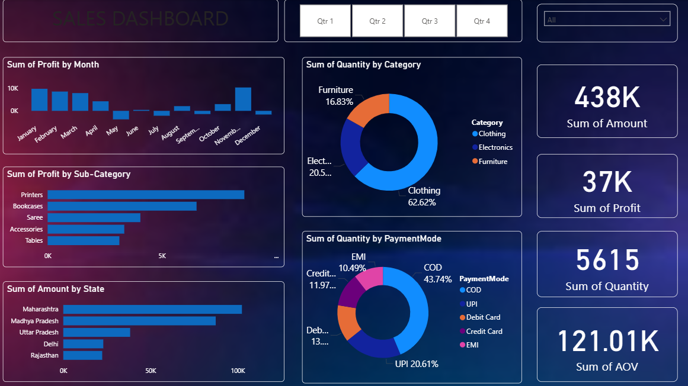

# 📊 Power BI Sales Dashboard

## 📌 Overview
This **Power BI Sales Dashboard** provides a comprehensive view of sales performance across various dimensions like **month**, **state**, **product category**, and **payment mode**.  
It delivers quick insights into **Sales Amount, Profit, Quantity Sold, and Average Order Value (AOV)** for smarter decision-making.

## ✨ Key Features
- **Quarter-wise Filter** → Easily analyze sales for each quarter.  
- **Sales by Month** → Track profit trends over time.  
- **Sales by Sub-Category** → Identify top-performing product segments.  
- **Sales by State** → Compare regional performance.  
- **Category-wise Quantity** → Visual distribution of product categories.  
- **Payment Mode Analysis** → Understand customer payment preferences.  
- **KPI Cards**:  
  - **Sum of Amount:** `118K`  
  - **Sum of Profit:** `12K`  
  - **Sum of Quantity:** `1409`  
  - **Average Order Value (AOV):** `33.10K`  

## 📂 Files Included
- `Sales_Dashboard.pbix` → Main Power BI dashboard file  
- `Dashboard.png` → Screenshot of the dashboard (for quick preview)  
- `Orders.csv` → Order-level dataset used for analysis  
- `Details.csv` → Product details dataset for enriching insights  

## 🚀 How to Use
1. **Download** the `.pbix` file from this repository.  
2. **Open** it in [Power BI Desktop](https://powerbi.microsoft.com/desktop/).  
3. **Explore** filters and interact with visualizations for deeper insights.

## 🖼 Screenshot

## 👤 Author
**Ishan Majumder**  
[LinkedIn](https://www.linkedin.com/in/ishan-majumder-19b060288/) | [Email](mailto:ishanmajumder28@gmail.com)
